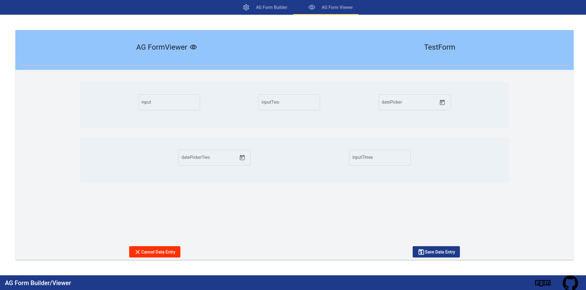

# AG-FormBuilder

AG-FormBuilder is an Angular library for creating dynamic forms and interacting with them.

## Here is an image of AG-Form Builder


## Here is an image of AG-Form Viewer


## Working Demo 

You can find a working demo [here](https://www.ag-form-builder.hossein.dev).
Feel free to work with it and try it out.
Make sure to check your console for the output once you want to save the form to get the data structure of ag-form builder/viewer


## Installation

Use the package manager NPM to install AG-FormBuilder.

```bash
npm i ag-form-builder
```

## Usage

## FormBuilder
import `AgFormBuilderModule` into your module
then you can use it in your template like bellow:

```
<lib-ag-form-builder (emittedForm)="handleFormInfo($event)"></lib-ag-form-builder>
```

## Locale
You have two options for the locale of your calendar, which you can set with `date locale`. You can find a list of them [here](https://www.science.co.il/language/Locale-codes.php).

```
<lib-ag-form-builder [dateLocale]="'en-US'"></lib-ag-form-builder>
```

## Edit An Existing Form

If you want to edit an existing form, you need to pass the data to the component like below:

```
<lib-ag-form-builder [formData]="mockForm"></lib-ag-form-builder>
```

Make sure that the `mockForm` has a type of : `AgMockFormDataModel`

## FormViewer
import `AgFormViewerModule` into your module
then you can use it in your template like bellow:

```
<lib-ag-form-viewer [formInfo]="mockForm" (emittedFormViewerInfo)="handleFormViewerInfo($event)"></lib-ag-form-viewer>
```


## Contributing

Pull requests are welcome. Please open an issue first to discuss what you would like to change for major changes. You can also discuss new ideas on issues.

## Star

If this tool helped you with your projects, you could give it a star!

## License

[MIT](https://choosealicense.com/licenses/mit/)
